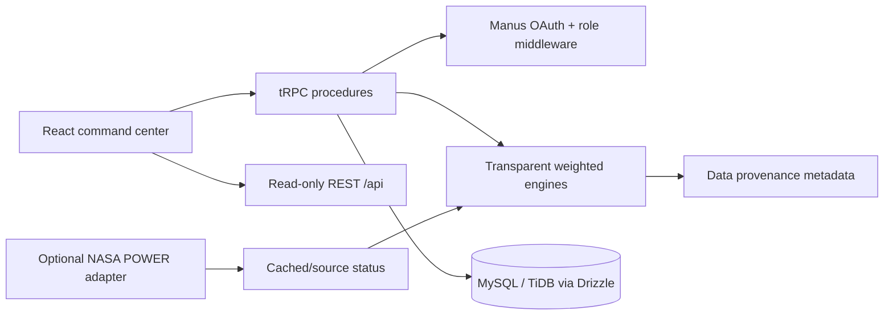

# Himalayan Spring Recharge Network

A production-style, full-stack **disaster and water-resource decision-support prototype** for Himalayan regions. It combines transparent weighted risk scoring, water-deficiency planning, hospital-capacity visibility, glacier reference records, public-data provenance, and a layered terrain visualization in one role-aware command center.

> **Important operational boundary:** this application produces model estimates and scenario calculations. It does not issue official government warnings, guarantee disaster predictions, or provide real-time hospital capacity. Synthetic/demo values are explicitly marked in the UI and in the source metadata.

## What is implemented

The application is a React 19 + TypeScript frontend served by an Express/tRPC backend with Drizzle/MySQL persistence and Manus OAuth. The database schema includes users and roles, regions, data sources, model configurations, predictions, hospitals, water resources, disaster events, and audit logs. The frontend provides four role workspaces: Disaster Manager, Water Manager, Hospital Manager, and DBA.

The central terrain panel offers a performance-friendly SVG 3D projection and a 2D fallback, with togglable rainfall, rivers, glacier, flood, landslide, and hospital layers. It is a geospatial visualization scaffold intended to accept GeoJSON/terrain tiles later without rewriting the dashboard contracts.

## Architecture



The frontend is in `client/`. The backend domain model and deterministic engines are in `server/domain.ts`. tRPC contracts are in `server/routers.ts`, REST aliases and OpenAPI are in `server/rest.ts`, and the relational schema is in `drizzle/schema.ts`.

## Local setup

Requirements: Node.js 22+, pnpm 10+, and a MySQL/TiDB database. A database is optional for read-only demo mode, but required for persisted users, model versions, and audit logs.

```bash
git clone https://github.com/its-krush/himalayan_spring_recharge_network.git
cd himalayan-spring-recharge-network
cp .env.example .env
pnpm install
pnpm drizzle-kit generate
pnpm drizzle-kit migrate
pnpm run dev
```

Open `http://localhost:3000`. If no `DATABASE_URL` is available, the app remains usable in demo mode; admin mutations are held in memory for the current server process and are not durable.

## Environment variables

See `.env.example`. The important variables are:

| Variable | Purpose |
| --- | --- |
| `DATABASE_URL` | MySQL/TiDB connection string for the relational schema. |
| `JWT_SECRET` | Session signing secret. |
| `VITE_APP_ID`, `OAUTH_SERVER_URL`, `VITE_OAUTH_PORTAL_URL` | Manus OAuth application settings. |
| `OWNER_OPEN_ID`, `OWNER_NAME` | Owner identity; the owner is promoted to DBA by the auth upsert helper. |
| `ENABLE_LIVE_INGESTION` | Set to `true` to enable the NASA POWER adapter. Default is `false`. |
| `PORT` | Server port; Render supplies this automatically. |

Never commit `.env`, credentials, or API tokens.

## Database and seed data

The schema is generated using Drizzle:

```bash
pnpm drizzle-kit generate
pnpm drizzle-kit migrate
pnpm run seed
```

`pnpm run seed` writes `data/ingestion-manifest.json` and prints the data provenance policy. The application domain seed is intentionally code-reviewed and kept in `server/domain.ts` so the demo can run without a database. A production ingestion implementation should persist successful public-source responses into the relational tables and retain their retrieval timestamp.

## Data-source policy

The UI includes a Data Provenance view for NASA POWER, GLIMS/NSIDC, HydroSHEDS, OpenStreetMap, and the explicit demo scenario dataset. The current build uses public-source **reference metadata** and a static synthetic fallback for demo operation. It does not claim the seeded rainfall, river, soil, glacier, or water values are live observations.

`server/ingestion.ts` includes an optional NASA POWER point adapter. It has three safe outcomes: `live` after a successful response, `cached` when live ingestion is disabled, and `unavailable` when a request fails. It never fabricates a response after a timeout or HTTP error. A deployment can add a scheduled refresh later using its hosting scheduler, but the application remains usable when the source is unavailable.

## Prediction engine

The initial model is intentionally transparent:

```text
score = Σ(clamped_feature_0_to_10 × normalized_feature_weight)
```

Default weights are centralized in `server/domain.ts` and persisted in `model_configs` when a database is configured:

| Feature | Default weight |
| --- | ---: |
| Rainfall | 28% |
| River / runoff | 20% |
| Soil | 16% |
| Terrain / slope | 14% |
| Glacier / snow | 10% |
| Historical hazard | 12% |

The UI shows each feature input, normalized weight, and contribution. Scores map to Low, Moderate, High, and Critical bands. The DBA workspace can update weights only through a backend-protected mutation; the UI is not the authorization boundary.

## Water calculations

Water calculations use normalized MLD units:

```text
Deficit (MLD) = max(0, demand - available)
Tankers = ceil(deficit × 1,000,000 / tanker_capacity_litres)
Estimated cost = tankers × cost_per_trip × trips × (1 + fuel_surcharge)
```

The result is an estimate and not a procurement commitment. The Water Manager mutation is protected by the `WATER_MANAGER` role.

## API documentation

The tRPC API is the typed application contract under `/api/trpc`. Read-only REST aliases are also available:

```text
GET /api/regions
GET /api/regions/{id}
GET /api/rainfall/{region}
GET /api/glaciers/{region}
GET /api/soil/{region}
GET /api/water/{region}
GET /api/flood-risk/{region}
GET /api/landslide-risk/{region}
GET /api/hospitals/nearby?regionId=uttarakhand
GET /api/alerts
GET /api/water-deficiency
GET /api/water-network/{region}
GET /api/data-sources
GET /api/openapi.json
```

The REST aliases are intentionally read-only. Mutations for hospital capacity, tanker estimates, and model configuration are available through role-protected tRPC procedures.

## Authentication and roles

Manus OAuth creates the authenticated user and session cookie. Backend procedures enforce roles:

| Role | Capability |
| --- | --- |
| `DBA` | Model weights, thresholds, tanker configuration, audit access, full platform access. |
| `DISASTER_MANAGER` | Risk views, alerts, disaster intelligence, and read access to water/hospitals. |
| `WATER_MANAGER` | Water resources and tanker estimates. |
| `HOSPITAL_MANAGER` | Hospital capacity updates; capacity remains labeled synthetic in the prototype. |

The top-bar workspace switcher is a visualization convenience for demo navigation. It does not grant backend permissions.

## Testing

```bash
pnpm check
pnpm build
pnpm test
```

The test suite covers logout cookie behavior, normalized risk scoring and contributions, water deficiency and tanker arithmetic, adequate-supply behavior, geographic distance sorting, invalid input validation, and role authorization. Frontend rendering is additionally verified through the WebDev preview build and responsive screenshot capture; browser click-through requires a logged-in OAuth session when protected mutations are exercised.

## Render deployment

Create a Render Blueprint from `render.yaml`, or configure the services manually:

1. Create a Render MySQL-compatible database or provide a managed MySQL/TiDB `DATABASE_URL`.
2. Create a web service from this repository.
3. Build command: `pnpm install --frozen-lockfile && pnpm drizzle-kit generate && pnpm drizzle-kit migrate && pnpm build`.
4. Start command: `pnpm start`.
5. Set `NODE_ENV=production`, `DATABASE_URL`, `JWT_SECRET`, OAuth values, `OWNER_OPEN_ID`, `OWNER_NAME`, and `ENABLE_LIVE_INGESTION=false`.
6. Set the health check path to `/api/trpc/system.health` or `/api/openapi.json`.
7. Update the Manus OAuth callback/redirect origin to the Render service URL.

The server serves the built Vite assets from `dist/public` and binds to Render's `PORT`. No CUDA, proprietary GIS runtime, or local-only process is required.

## Known limitations and audit notes

- The current frontend terrain is a performant SVG 3D projection, not a full satellite/DEM globe. It is deliberately structured as a fallback-safe visualization layer.
- Public sources are documented and linked, but live retrieval is opt-in and not executed in default demo mode. The UI reports cached/reference status instead of silently substituting fabricated values.
- Hospital locations are reference geography; capacity counts are synthetic.
- Demo rainfall, soil, water-demand, risk features, and disaster scenarios are synthetic and clearly labeled.
- No routing API is configured, so nearby-hospital recommendations show geographic distance only and do not invent travel times.
- The demo data is not an official emergency feed and must be replaced or validated for operational deployment.
