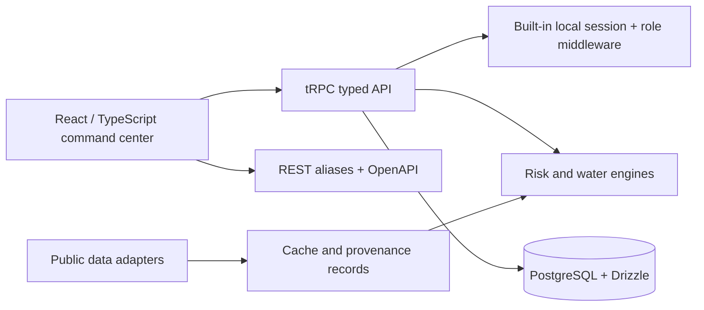
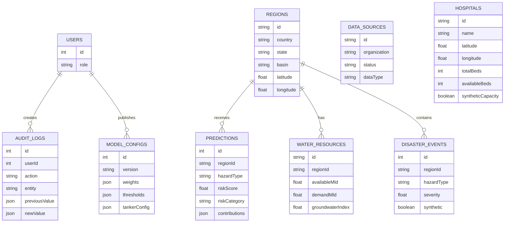

# Architecture, ER, and data-flow diagrams

## Architecture



## Database entity overview



## Data flow

```mermaid
sequenceDiagram
  participant U as Operator
  participant UI as Dashboard
  participant API as API layer
  participant M as Weighted engine
  participant DB as Database
  participant SRC as Public source adapter
  U->>UI: Select region / scenario
  UI->>API: Request region + risk + water context
  API->>DB: Read active model config when configured
  API->>M: Clamp features and normalize weights
  M-->>API: Score, category, contributions, model version
  API-->>UI: Explainable result + provenance status
  UI->>SRC: Optional refresh request
  SRC-->>UI: live / cached / unavailable; never fabricated
  U->>UI: Save config or capacity
  UI->>API: Protected mutation
  API->>DB: Persist change + audit log
```
